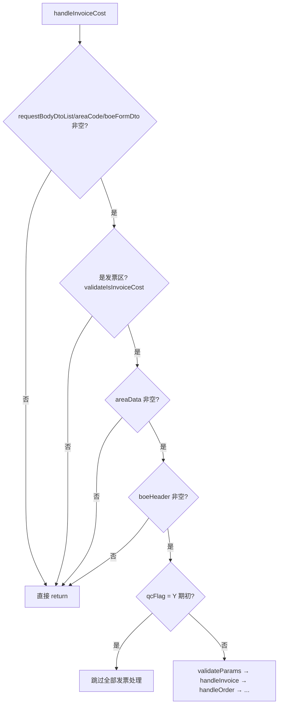

# InvoiceHandleService 发票处理逻辑分析

> 源文件：`src/main/java/cn/ztessc/service/boe/boecreate/InvoiceHandleService.java`  
> 分析起点：第 125 行（接口入参发票数据处理）

---

## 一、整体入口与数据从哪里来

主入口是 `handleInvoiceCost`（第 95 行），第 125 行是核心处理的中段：

```java
// 校验发票区传参
this.validateParams(areaData, areaCode);
// 处理发票
JSONArray invoiceData = this.handleInvoice(areaData, boeHeader);
// 处理订单
JSONArray orderData = this.handleOrder(areaCode, areaData, boeHeader);
// 将发票和订单数据组合起来
invoiceData.addAll(orderData);
// put到areaCode区域
boeFormDto.put(areaCode, buildLineNum(invoiceData));
// ...
// 校验业务小类
this.validateInvoiceOpeSubType(areaCode, areaData, boeHeader);
// OCR原始拍照图片或电子发票的版式文件带出到附件区或影像区
this.invoiceIntoAttr(boeFormDto, areaData);
```

### 数据来源

| 数据 | 来源 | 说明 |
|------|------|------|
| `areaData` | `boeFormDto.get(areaCode)` | 接口传入的单据表单 JSON 中，发票区（如 `cost`）的 **行数组** |
| `boeHeader` | `boeFormDto.get("boeHeader")` | 主表区：申请人、核算主体、业务大类、单据状态等 |
| `requestBodyDtoList` | 接口字段元数据 | 用于判断当前区域是否为「发票区」 |

接口侧发票区每行通常只传 **识别键**，系统再去「发票池/订单池」查完整数据并回填。

---

## 二、前置条件（125 行之前）



### 是否发票区（validateIsInvoiceCost）

请求体元数据中必须同时包含这三个字段编码才算发票区：

- `operationSubTypeId`（业务小类）
- `billingCode`（发票号码）
- `billingNo`（发票代码）

### 期初单据（qcFlag = Y）

不做数据源校验、必填校验、系统存在性校验、金额校验，直接 return。

---

## 三、第 125 行核心流程

```
validateParams(入参校验)
    ↓
handleInvoice(按发票号码查池子)  → invoiceData
    ↓
handleOrder(按订单编号查池子)    → orderData
    ↓
invoiceData.addAll(orderData)    → 合并
    ↓
buildLineNum                     → 写 lineNum 行号
    ↓
boeFormDto.put(areaCode, ...)    → 回写表单
    ↓
validateInvoiceAmount(提交态)    → 金额平衡校验
    ↓
validateInvoiceOpeSubType        → 业务小类校验
    ↓
invoiceIntoAttr                  → 影像/附件带出
```

---

## 四、入参校验 validateParams

对 `areaData` 数组 **逐行** 校验：

| 字段 | 常量名 | 校验规则 |
|------|--------|----------|
| `orderNumber` | 订单编号 | 与 `billingCode` **不能同时有值**（互斥） |
| `billingCode` | 发票号码 | 同上 |
| `billTypeInvoice` | 票据类型 | 与 `orderNumber` 必须 **同时为空或同时有值** |
| `orderNumber` | 订单编号 | 同上 |
| `billTypeInvoice` | 票据类型 | 有值时必须在系统字典 `BILL_TYPE_INVOICE` 下有效 |

错误码：`boe.create.inter.045` / `046` / `047`。

**结论**：接口每行只能是两种模式之一：

1. **发票模式**：`billingCode`（+ 可选 `billingNo`），`orderNumber` 为空
2. **订单模式**：`billTypeInvoice` + `orderNumber` 同时有值，`billingCode` 为空

---

## 五、发票数据处理 handleInvoice（按发票号码）

### 5.1 筛选与去重

遍历 `areaData`，只处理 **`billingCode` 非空** 的行：

- 去重键：`billingCode + 分隔符 + billingNo`
- `billingNo` 为空时用空字符串

### 5.2 查发票池

对每条有效行 **异步并发** 调用 `boeInvoiceTicketService.orderPage`：

| 查询参数 | 来源 |
|----------|------|
| `employeeCode` | 主表 `employeeCode` |
| `employeeId` | 主表 `employeeId` |
| `leId` | 主表核算主体 |
| `reimbursementState` | `NOT`（未报销） |
| `billingCode_EQ` | 入参 `billingCode` |
| `billingNo_EQ` | 入参 `billingNo` |
| `page=1, limit=10` | 固定 |

查不到或结果为空 → 抛 `boe.create.inter.020`（无法找到该发票号码的发票）。  
超时 30 秒 → 抛「发票查询超时」。

### 5.3 赋值 putInvoiceData(invoiceObj, 池子第一条)

**入参行 `invoiceObj` 保留接口已有字段**，再用池子数据 **覆盖/补充**：

| 池子字段 | 处理规则 |
|----------|----------|
| 任意字段 | 值为空则 **不赋值** |
| `id` | 赋给 `referenceId`（不直接写 `id`） |
| `billTypeInvoice` | 同时赋给 `referenceType` |
| `fee` | 同时赋给 `expenseAmount`（报销金额） |
| `ticketData`（JSON 对象） | **展平到外层**，各子字段写入 `invoiceObj` |
| 其他非空字段 | 直接 `invoiceObj.put(fieldCode, fieldValue)` |

之后调用 `setInvoiceIntoExtendMap`，把以下字段 **额外写入 `extendMap`**（供缓存/展示）：

- `airNumber`
- `arriveCityName`
- `attribute`
- `billingCode`
- `billingNo`
- `checkinDate`
- `checkoutDate`
- `excessiveReason`
- `fee`
- `flightNumber`
- `inputTransferFlag`
- `invoiceTypeCode`
- `payModeName`
- `reduceAmount`
- `reimbursementMethod`
- `seatLevel`
- `startOffCityName`
- `tax`
- `ticketTypeName`
- `tripDate`
- `validState`
- `validStateName`

**接口传入、池子未覆盖的字段**（如 `operationSubTypeId`）会保留在 `invoiceObj` 上。

---

## 六、订单数据处理 handleOrder（按订单编号）

### 6.1 筛选与去重

只处理 **`orderNumber` 非空** 的行：

- 去重键：`billTypeInvoice + 分隔符 + orderNumber`

### 6.2 批量查订单池

收集所有 `orderNumber`，按 **200 条一批** 调用 `orderPage`：

| 查询参数 | 来源 |
|----------|------|
| `employeeCode/employeeId/leId` | 主表 |
| `reimbursementState` | `NOT` |
| `orderNumbers` | 批次订单号（角度分隔符拼接） |
| `page=1, limit=MAX` | 分页 |

### 6.3 匹配与赋值

池子结果按 `billTypeInvoice + orderNumber` 分组（代码里用 `airNumber` 存订单号）。

对每条入参订单行：

1. 按 `billTypeInvoice + orderNumber` 匹配池子数据
2. 找不到 → `boe.create.inter.048`
3. `flightStatus` 为 `Canceled` / `Cancelled` → 同样 048
4. 调用 `putInvoiceData(order, 池子DTO)`（规则同发票）
5. 额外把整个 DTO 转 Map 写入 `extendMap`（**去掉 `id`**，避免覆盖单据行 id）

---

## 七、合并与行号 buildLineNum

发票行 + 订单行合并后，从 0 开始写 `lineNum`，回写到 `boeFormDto[areaCode]`。

```java
for (int i = 0; i < invoiceDatas.size(); i++) {
    JSONObject invoiceData = ZfsAliJsonUtils.parseObj(item);
    invoiceData.put("lineNum", i);
    jsonArray.add(invoiceData);
}
```

---

## 八、金额校验 validateInvoiceAmount

**触发条件**：主表 `boeStatus` 为空或等于 `20`（提交态）。

汇总字段：**每行 `expenseAmount`**（来自池子 `fee` 的映射）。

### 8.1 支付区 / 核销区平衡（多种模板）

若模板属于日常费用、会议费、招待费、差旅、多人差旅、对外预付款、资产报账、员工借款、采购预付款、资产预付款等，且 **存在支付区**：

| 场景 | 公式 |
|------|------|
| 有核销区 | `发票总额 = 支付区总额 + 核销区总额` |
| 无核销区 | `发票总额 = 支付区总额` |

错误：`boe.create.inter.053` / `022`。

### 8.2 归属区平衡（部分模板）

日常费用、会议费、招待费、差旅、多人差旅：

- `发票总额 = 归属区总额`
- 不等 → `boe.create.inter.021`

---

## 九、业务小类校验 validateInvoiceOpeSubType

对合并后每行的 **`operationSubTypeId`**（接口可传，处理过程中保留）：

1. 去重后查缓存 `BIZCATEGORY`
2. 必须存在且有效 → 否则 `boe.create.inter.017`
3. 小类的 `pid` 必须等于主表 **`operationTypeId`（业务大类）** → 否则 `boe.create.inter.029`

---

## 十、影像/附件带出 invoiceIntoAttr

处理完成后，从池子带回的 URL 字段：

| 字段 | 用途 |
|------|------|
| `smallImageUrl` | OCR 小图 |
| `bigImageUrl` | 大图/版式文件 |

| 条件 | 去向 |
|------|------|
| 有 `smallImageUrl`，且 `bigImageUrl` 不是 PDF/OFD | → `imageList`（影像区） |
| `bigImageUrl` 以 PDF/OFD 结尾 | → `fileList`（附件区） |

附件命名：`电子发票 + billingCode + 后缀`  
有 `operationSubTypeId` 的附件按业务小类匹配附件清单；无则归为「全部附件」。

---

## 十一、接口字段 vs 系统字段对照

### 接口主要传入（识别 + 业务）

| 字段 | 角色 |
|------|------|
| `billingCode` | 发票模式主键，触发查池 |
| `billingNo` | 发票代码，参与精确匹配与去重 |
| `billTypeInvoice` | 订单模式必填，字典校验 |
| `orderNumber` | 订单模式主键，触发查池 |
| `operationSubTypeId` | 业务小类，后续校验，不参与查池 |

### 系统查池后回填（重点）

| 字段 | 说明 |
|------|------|
| `referenceId` | 池子记录 id |
| `referenceType` | = `billTypeInvoice` |
| `expenseAmount` | = `fee` |
| `ticketData` 内各字段 | 展平到行上 |
| `extendMap` | 上述 22 个扩展字段副本 |
| 池子其他非空字段 | 直接覆盖/补充到行上 |
| `smallImageUrl` / `bigImageUrl` | 用于影像附件 |
| `lineNum` | 合并后行序号 |

---

## 十二、流程小结

```
接口 JSON
  boeFormDto[areaCode] = [{ billingCode/billingNo } 或 { billTypeInvoice, orderNumber }, operationSubTypeId?, ...]
       │
       ├─ billingCode 有值 → 发票池精确查 → putInvoiceData enrichment
       │
       └─ orderNumber 有值 → 订单池批量查 → putInvoiceData + extendMap(全量DTO)
       │
       ▼
  合并 + lineNum → 回写 boeFormDto
       │
       ├─ 提交态 → 金额 vs 支付/核销/归属区
       ├─ operationSubTypeId vs 业务大类
       └─ OCR/PDF/OFD → 影像区/附件区
```

**核心设计**：接口只传「钥匙」（发票号或订单号+票据类型），完整发票/订单数据从 **`boeInvoiceTicketService.orderPage`** 拉取，再通过 `putInvoiceData` 统一映射到单据行；接口自带的业务小类等字段在 enrichment 之后仍保留并单独校验。

---

## 十三、相关方法索引

| 方法 | 行号（约） | 职责 |
|------|-----------|------|
| `handleInvoiceCost` | 95 | 发票区处理主入口 |
| `buildLineNum` | 152 | 设置行号 |
| `handleOrder` | 180 | 订单池查询与赋值 |
| `validateParams` | 272 | 入参互斥与字典校验 |
| `validateIsInvoiceCost` | 337 | 判断是否发票区 |
| `validateInvoiceOpeSubType` | 363 | 业务小类校验 |
| `handleInvoice` | 414 | 发票池查询与赋值 |
| `putInvoiceData(JSONArray, List, String)` | 536 | 订单批量赋值 |
| `putInvoiceData(JSONObject, JSONObject)` | 586 | 单条字段映射 |
| `setInvoiceIntoExtendMap` | 642 | extendMap 扩展字段 |
| `validateInvoiceAmount` | 702 | 金额平衡校验 |
| `invoiceIntoAttr` | 776 | 影像/附件带出 |
| `buildImageList` | 846 | 构建影像数据 |
| `buildAttrList` | 872 | 构建附件数据 |
| `handleOstAttrList` | 911 | 业务小类附件清单 |
| `getEnclosureList` | 965 | 查询附件清单配置 |

---

## 十四、调用链

`BoeCreateCommonService.validateDataValidityFlag` → `invoiceHandleService.handleInvoiceCost(requestBodyDTOList, areaCode, boeFormDto)`

在通用数据源校验（`validateDataByDataSource`）之后执行。

---

## 十五、orderPage 真实示例：入参差异与字段映射

### 15.1 页面查票 vs 接口同步查票

你提供的 `orderPage` 入参（按 **ids** 查）是**页面选票**场景：

```json
{
  "leId": "8ebd330944202eab7f2eb1b0aeb85119",
  "ids": "a4f8cda312b94e6d813e31302e386ceb",
  "employeeId": "e19760e2026fc71d8f00b1b0aeb824ce",
  "employeeCode": "qcdb80003",
  "reimbursementState": "1",
  "limit": "1000",
  "page": "1"
}
```

`InvoiceHandleService` **不会**传 `ids`，而是按接口入参构造不同查询条件：

| 场景 | orderPage 关键参数 |
|------|-------------------|
| 发票模式 `handleInvoice` | `billingCode_EQ` + `billingNo_EQ` + `reimbursementState=1` + 主表 `employeeCode/employeeId/leId` |
| 订单模式 `handleOrder` | `orderNumbers`（批量）+ `reimbursementState=1` + 主表 `employeeCode/employeeId/leId` |

对应本例发票，接口同步应传：

```json
{
  "billingCode": "26447000000696461548",
  "billingNo": "",
  "operationSubTypeId": "（可选，接口传入）"
}
```

`handleInvoice` 实际查池参数等价于：

```json
{
  "employeeCode": "qcdb80003",
  "employeeId": "e19760e2026fc71d8f00b1b0aeb824ce",
  "leId": "8ebd330944202eab7f2eb1b0aeb85119",
  "reimbursementState": "1",
  "billingCode_EQ": "26447000000696461548",
  "billingNo_EQ": "",
  "page": 1,
  "limit": 10
}
```

查到的 `list[0]` 与你提供的返回结构一致，再进入 `putInvoiceData` 赋值。

---

### 15.2 putInvoiceData 对本例返参的映射规则

`putInvoiceData(invoiceObj, list.get(0))` 处理逻辑：

1. 遍历返参每个字段，**值为 null 或空字符串则跳过**（不赋值）
2. 特殊字段额外映射
3. `ticketData` 内层字段**展平到行外层**
4. 调用 `setInvoiceIntoExtendMap` 写入 `extendMap`

#### 特殊映射（本例实际值）

| 返参字段 | 写入单据行字段 | 本例值 |
|----------|---------------|--------|
| `id` | `referenceId` | `a4f8cda312b94e6d813e31302e386ceb` |
| `billTypeInvoice` | `billTypeInvoice` + `referenceType` | `"32"` |
| `fee` | `fee` + `expenseAmount` | `3710.71` |

> `expenseAmount` 用于后续 `validateInvoiceAmount` 金额汇总校验。

#### ticketData 展平（本例关键字段）

`ticketData` 中非空字段会覆盖/补充到行外层，本例包括：

| ticketData 字段 | 值 | 说明 |
|-----------------|-----|------|
| `billingCode` | `26447000000696461548` | 发票号码 |
| `billingTime` | `2026-03-27` | 开票日期 |
| `fee` | `3710.71` | 价税合计 |
| `feeWithoutTax` | `3283.81` | 不含税金额 |
| `tax` | `426.9` | 税额 |
| `buyerName` | `中国邮电器材东北有限公司` | 购方名称 |
| `buyerNumber` | `91210106701989691B` | 购方税号 |
| `sellerName` | `华为终端有限公司` | 销方名称 |
| `sellerNumber` | `914419000585344943` | 销方税号 |
| `billTypeInvoice` | `32` | 票据类型 |
| `invoiceTypeCode` | `09` | 发票类型编码 |
| `validState` | `003` | 查验状态 |
| `dataSource` | `13` | 数据来源 |
| `reimbursementState` | `2` | ⚠️ 与外层 `"1"` 可能冲突，取决于 JSON 遍历顺序 |

#### 外层直接写入的非空字段（节选）

| 字段 | 本例值 |
|------|--------|
| `billTypeInvoiceName` | 电子发票（增值税专用发票） |
| `validStateName` | 查验成功 |
| `reimbursementStateName` | 未报销 |
| `dataSourceName` | ERP |
| `sellerName` | 华为终端有限公司 |
| `buyerName` | 中国邮电器材东北有限公司 |
| `holderName` / `holderCode` | 器材东北提单人 / qcdb80003 |
| `createName` | 器材东北提单人 |
| `boeNo` | AP-260525-106923-2 |
| `postState` / `postStateName` | RZZT01 / 未入账 |
| `authState` / `authStateName` | RZZT0001 / 未认证 |
| `opTicketDetailsList` | 2 条明细（整数组保留，不展平） |

#### 被跳过的字段（空值不赋值）

本例中以下字段为 `""` 或 `null`，**不会写入单据行**：

- `airNumber`、`checkoutDate`、`checkinDate`、`tripDate`
- `startOffCityName`、`arriveCityName`、`flightNumber`
- `attribute`、`payModeName`、`inputTransferFlag`
- `operationSubTypeId`（返参为 null；若接口传入则保留接口值）

#### opTicketDetailsList 明细结构

返参含 2 条发票明细，保留为嵌套数组 `opTicketDetailsList`，每条含 `ticketDetailsData`：

| 行号 | 商品名称 | 金额 sum | 税额 tax |
|------|----------|----------|----------|
| 1 | *计算机外部设备*华为灵犀手写笔 砚黑 | 4601.77 | 598.23 |
| 2 | *计算机外部设备*华为灵犀手写笔 砚黑 | -1317.96 | -171.33 |

明细行**不会**被 `putInvoiceData` 展平到外层，整段数组挂在单据发票行上。

---

### 15.3 extendMap 写入（setInvoiceIntoExtendMap）

从赋值后的 `invoiceObj` 取以下 22 个字段写入 `extendMap`（值为 null 也会 put）：

本例有实际值的 extendMap 字段：

| extendMap 键 | 来源值 |
|--------------|--------|
| `billingCode` | `26447000000696461548`（来自 ticketData 展平） |
| `fee` | `3710.71` |
| `validState` | `003` |
| `validStateName` | `查验成功` |
| `invoiceTypeCode` | `09` |

其余如 `airNumber`、`tax`、`tripDate` 等在本例中为空/null。

---

### 15.4 本例完整处理链路示意

```
接口入参行
  { "billingCode": "26447000000696461548", "operationSubTypeId": "xxx" }
       │
       ▼
handleInvoice → orderPage(billingCode_EQ=26447000000696461548, ...)
       │
       ▼
putInvoiceData(入参行, list[0])
  ├─ referenceId  = a4f8cda312b94e6d813e31302e386ceb
  ├─ referenceType  = 32
  ├─ expenseAmount  = 3710.71
  ├─ ticketData 展平 → billingCode/fee/tax/buyerName/...
  ├─ opTicketDetailsList 整段保留
  └─ extendMap 写入 billingCode/fee/validState 等
       │
       ▼
buildLineNum → lineNum = 0
       │
       ▼
validateInvoiceAmount → 汇总 expenseAmount = 3710.71
validateInvoiceOpeSubType → 校验接口传入的 operationSubTypeId
invoiceIntoAttr → 若返参含 smallImageUrl/bigImageUrl 则带出影像/附件
```

---

### 15.5 注意事项

1. **ids 与 billingCode 是两种查票方式**：接口同步走 `billingCode_EQ`，不走 `ids`；结果结构相同。
2. **接口字段优先保留**：`operationSubTypeId` 等接口传入、池子返参为 null 的字段，enrichment 后仍保留接口值。
3. **金额校验字段**：`validateInvoiceAmount` 汇总的是 `expenseAmount`（= 池子 `fee` = 3710.71），不是明细行 sum 相加。
4. **reimbursementState 双层值**：外层 list 项为 `"1"`（未报销），`ticketData` 内为 `"2"`；展平后可能被覆盖，以实际 JSON 遍历顺序为准。
5. **本例无影像 URL**：返参未含 `smallImageUrl`/`bigImageUrl`，`invoiceIntoAttr` 不会生成影像/附件。
