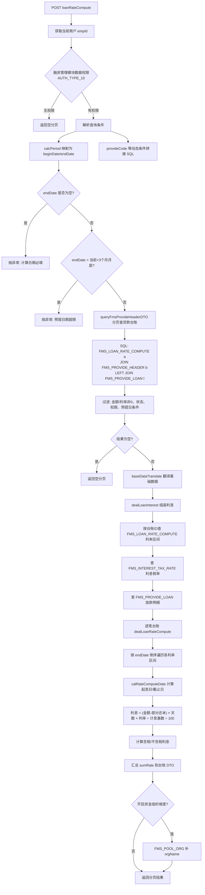
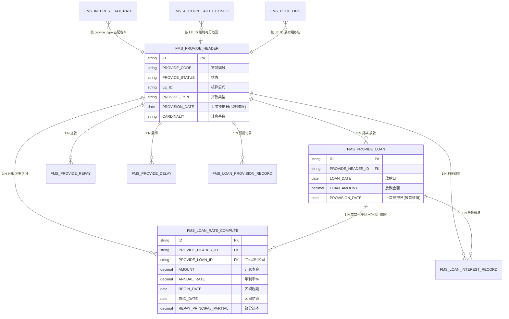

# loanRateCompute 接口业务分析

> 接口：`cn.ztessc.controller.loan.FmsLoanInterestRecordController#loanRateCompute`  
> 路径：`POST /fmsLoanInterestRecord/loanRateCompute`  
> 模块：zfs-fms-settlement-core

---

## 1. 接口概述

| 项目 | 说明 |
|------|------|
| **功能** | 贷款利息计算 / 预提查询（只读，不落库） |
| **输入** | 分页参数 + 查询条件（含计算截止日、贷款状态、贷款编号等） |
| **输出** | 分页的贷款台账列表，每条含各利率区间利息明细及合计 |
| **Controller** | `FmsLoanInterestRecordController#loanRateCompute` |
| **Service** | `FmsLoanInterestRecordService#loanRateCompute` |

---

## 2. 请求参数说明

### 2.1 示例请求

```
page=1&limit=20&orderField=&order=&provideStatusIn=2^3^7&query=[{"code":"calcPeriod","fieldType":7,"value":"2026-06-30","condition":6},{"code":"provideCode","condition":3,"fieldType":1,"value":"2310202201100000666"}]
```

### 2.2 参数解析

| 参数 | 示例值 | 含义 |
|------|--------|------|
| `page` / `limit` | 1 / 20 | 分页 |
| `orderField` / `order` | 空 | 排序字段与方向（空则默认按贷款编号排序） |
| `provideStatusIn` | `2^3^7` | 贷款状态 IN 过滤（`^` 为分隔符） |
| `query[0]` | `calcPeriod=2026-06-30, condition=6` | 计算截止日 = 2026-06-30 |
| `query[1]` | `provideCode=..., condition=3` | 贷款编号包含匹配 |

### 2.3 条件符号映射

| condition | 符号 | 说明 |
|-----------|------|------|
| 6 | `=` | `calcPeriod` 映射为 `endDate` |
| 9 | `≥` | `calcPeriod` 映射为 `beginDate` |
| 10 | `≤` | `calcPeriod` 映射为 `endDate` |
| 3 | 包含 | `provideCode` 模糊匹配 |

### 2.4 贷款状态枚举（provideStatusIn）

| 值 | 名称 |
|----|------|
| 1 | 签约 |
| **2** | **还款中** |
| **3** | **已放款** |
| 4 | 已还款 |
| 5 | 已废弃 |
| 6 | 已结项 |
| **7** | **展期** |

示例 `provideStatusIn=2^3^7` 表示：还款中、已放款、展期。

### 2.5 预提模式 vs 利息计算模式

- **未传 `beginDate`**：预提查询模式。起息日取「上次预提日」与利率区间起始日的较大值。
- **传入 `beginDate`**：利息计算查询模式。起息日取「查询开始日」与利率区间起始日的较大值。

---

## 3. 业务逻辑流程图



---

## 4. 核心方法调用链

```
FmsLoanInterestRecordController#loanRateCompute
  └── FmsLoanInterestRecordService#loanRateCompute
        ├── fmsAccountAuthConfigService.getAuthAccountSqlMap()     // 数据权限
        ├── FmsStaticConditionUtil.preQueryCriteriaByReplace()    // 条件映射
        ├── queryFmsProvideHeaderDTO()                            // 分页查贷款台账
        │     ├── splicingCondition()                             // 静态条件
        │     ├── QueryConditionUtils.splicingConditionSql()      // 动态 query 条件
        │     └── fmsAccountAuthConfigService.getAuthAccountExistsByLeId()
        ├── dealLoanInterest()
        │     ├── queryFmsLoanRateCompute()                       // 查利率区间
        │     ├── getInterestTaxRate()                            // 查利息税率
        │     └── dealProvideHeaderAndLoanRateCompute()
        │           └── dealLoanRateCompute()                     // 逐区间算息
        │                 └── calRateComputeDate()                // 起止日计算
        └── fmsPoolOrgService.setOrgNameForList()                 // 可选：资金组织名
```

---

## 5. 利息计算规则

### 5.1 起息日 / 截止日（calRateComputeDate）

**预提模式（无 beginDate）**

| 场景 | 起息日计算 |
|------|-----------|
| 有放款关联 | max(放款.PROVISION_DATE, 利率区间.BEGIN_DATE) |
| 无放款（展期） | max(台账.PROVISION_DATE, 利率区间.BEGIN_DATE) |

**利息计算模式（有 beginDate）**

- 起息日 = max(查询 beginDate, 利率区间.BEGIN_DATE)

**截止日（两种模式相同）**

- 截止日 = min(查询 endDate, 利率区间.END_DATE)

### 5.2 利息公式

```
利息 = (金额 - 部分还本金额) × 天数 × 年利率(%) / 计息基数 / 100
```

| 字段 | 来源 |
|------|------|
| 金额 | `FMS_LOAN_RATE_COMPUTE.AMOUNT` |
| 部分还本 | `FMS_LOAN_RATE_COMPUTE.REPAY_PRINCIPAL_PARTIAL` |
| 天数 | 起息日至截止日（含头不含尾或按 DateUtil.betweenDay） |
| 年利率 | `FMS_LOAN_RATE_COMPUTE.ANNUAL_RATE` |
| 计息基数 | 优先放款维度，否则台账维度（如 360、365） |

**跳过计算条件**：天数为 0，或金额/利率为 0。

### 5.3 含税拆分

```
不含税利息 = 计算利息 / (1 + 税率)
税额       = 不含税利息 × 税率
```

税率来源：`FMS_INTEREST_TAX_RATE`，按贷款类型（`provide_type`）匹配。

### 5.4 日期校验

- `endDate` 必填，否则抛异常。
- `endDate` 不得超过「当前日期 + 3 个月」的月底。

---

## 6. 涉及的数据表

### 6.1 直接参与查询 / 计算

| 表名 | 实体类 | 角色 |
|------|--------|------|
| **FMS_LOAN_RATE_COMPUTE** | `FmsLoanRateComputeEntity` | 利息计算核心：时间段内的本金、利率、起止日 |
| **FMS_PROVIDE_HEADER** | `FmsProvideHeaderEntity` | 贷款台账（合同主表） |
| **FMS_PROVIDE_LOAN** | `FmsProvideLoanEntity` | 放款记录（LEFT JOIN，取预提日、计息基数等） |
| **FMS_INTEREST_TAX_RATE** | `FmsInterestTaxRateEntity` | 按贷款类型配置利息税率 |
| **FMS_ACCOUNT_AUTH_CONFIG** | `FmsAccountAuthConfigEntity` | 融资模块（AUTH_TYPE_10）数据权限 |
| **FMS_POOL_ORG** | `FmsPoolOrgEntity` | 可选：按核算公司展示资金组织名称 |

### 6.2 间接关联（本接口不直接查）

| 表名 | 实体类 | 关系说明 |
|------|--------|----------|
| **FMS_LOAN_INTEREST_RECORD** | `FmsLoanInterestRecordEntity` | 利率调整记录；放款/调息时生成，用于构建利率区间 |
| **FMS_PROVIDE_REPAY** | — | 还款记录；还本后切分利率区间、更新本金 |
| **FMS_PROVIDE_DELAY** | — | 展期记录；展期后重建利率区间（provide_loan_id 为空） |
| **FMS_LOAN_PROVISION_RECORD** | `FmsLoanProvisionRecordEntity` | 利息预提记录；预提成功后更新 PROVISION_DATE |

---

## 7. 数据表业务关联关系

### 7.1 ER 关系图



### 7.2 关联说明

1. **FMS_PROVIDE_HEADER → FMS_PROVIDE_LOAN**  
   一笔贷款可多次放款；每条放款有独立预提日和计息基数。

2. **FMS_LOAN_RATE_COMPUTE 是计算快照**  
   由放款、还款、展期、利率调整等事件，通过 `FmsProvideLoanService#buildInterestRecord()` 切分生成；每条记录表示某段时间内的剩余本金 + 适用利率。

3. **PROVIDE_LOAN_ID 区分维度**  
   - 有值：放款维度，使用 `FMS_PROVIDE_LOAN.PROVISION_DATE`  
   - 为空：展期维度，使用 `FMS_PROVIDE_HEADER.PROVISION_DATE`

4. **FMS_LOAN_INTEREST_RECORD → FMS_LOAN_RATE_COMPUTE**  
   利率调整记录决定各区间 `ANNUAL_RATE`；本接口只读 `FMS_LOAN_RATE_COMPUTE`，不查调息表。

5. **FMS_LOAN_PROVISION_RECORD**  
   本接口不直接查询；预提成功后更新 `PROVISION_DATE`，影响下次预提的起息日。

---

## 8. 核心 SQL 逻辑

### 8.1 分页查贷款台账（queryFmsProvideHeaderDTO）

```sql
SELECT DISTINCT b.*
FROM FMS_LOAN_RATE_COMPUTE a
INNER JOIN FMS_PROVIDE_HEADER b ON a.PROVIDE_HEADER_ID = b.ID
LEFT JOIN FMS_PROVIDE_LOAN l ON l.ID = a.PROVIDE_LOAN_ID AND l.ENABLED_FLAG = '0'
WHERE a.BEGIN_DATE < :endDate
  AND a.AMOUNT != 0 AND a.AMOUNT IS NOT NULL
  AND a.ANNUAL_RATE != 0 AND a.ANNUAL_RATE IS NOT NULL
  -- 预提模式（无 beginDate）：
  AND (
    (a.END_DATE > l.PROVISION_DATE AND l.PROVISION_DATE < :endDate AND a.PROVIDE_LOAN_ID IS NOT NULL)
    OR
    (a.END_DATE > b.PROVISION_DATE AND b.PROVISION_DATE < :endDate AND a.PROVIDE_LOAN_ID IS NULL)
  )
  AND b.ENABLED_FLAG = '0'
  AND b.VALIDITY_FLAG = '0'
  AND b.GROUP_ID = :groupId
  AND b.PROVIDE_STATUS IN (:provideStatusIn)   -- 示例: 2,3,7
  AND b.PROVIDE_CODE LIKE :provideCode         -- 示例: %2310202201100000666%
  AND [数据权限: b.LE_ID IN 授权核算主体]
ORDER BY b.PROVIDE_CODE, b.ID ASC
```

### 8.2 查利率区间（queryFmsLoanRateCompute）

```sql
SELECT a.*
FROM FMS_LOAN_RATE_COMPUTE a
INNER JOIN FMS_PROVIDE_HEADER b ON b.ID = a.PROVIDE_HEADER_ID
LEFT JOIN FMS_PROVIDE_LOAN l ON l.ID = a.PROVIDE_LOAN_ID AND l.ENABLED_FLAG = '0'
WHERE a.BEGIN_DATE < :endDate
  AND a.PROVIDE_HEADER_ID IN (:provideHeaderIdList)
  -- 预提模式条件同上
```

### 8.3 示例请求对应条件

| 条件 | 值 |
|------|-----|
| 计算截止日 | 2026-06-30 |
| 贷款状态 | 还款中(2)、已放款(3)、展期(7) |
| 贷款编号 | 包含 `2310202201100000666` |
| 分页 | 第 1 页，每页 20 条 |

---

## 9. 返回结构（概要）

每条 `FmsProvideHeaderDTO` 包含：

| 字段 | 说明 |
|------|------|
| 台账基本信息 | 贷款编号、类型、银行、核算公司等 |
| `fmsLoanInsertDTOList` | 各利率区间利息明细 |
| `sumRate` | 该笔贷款利息合计 |
| `interestTaxAmountSum` | 税额合计（有税率配置时） |
| `interestExcTaxSum` | 不含税利息合计 |
| `orgName` | 资金组织名称（开启维度时） |

`fmsLoanInsertDTOList` 单条明细字段：

| 字段 | 说明 |
|------|------|
| `provideLoanCode` | 放款编号 |
| `provideAmount` | 计息本金 |
| `alterAfterInterest` | 适用利率 |
| `interestBeginDate` / `interestEndDate` | 起息日 / 截止日 |
| `days` | 计息天数 |
| `computeRate` | 计算利息 |
| `interestTaxRate` / `interestTaxAmount` / `interestExcTax` | 税率相关 |

---

## 10. 关键源码位置

| 文件 | 方法 | 说明 |
|------|------|------|
| `FmsLoanInterestRecordController.java` | `loanRateCompute` | 接口入口 |
| `FmsLoanInterestRecordService.java` | `loanRateCompute` | 主流程 |
| `FmsLoanInterestRecordService.java` | `queryFmsProvideHeaderDTO` | 分页查台账 |
| `FmsLoanInterestRecordService.java` | `queryFmsLoanRateCompute` | 查利率区间 |
| `FmsLoanInterestRecordService.java` | `dealLoanRateCompute` | 逐区间算息 |
| `FmsLoanInterestRecordService.java` | `calRateComputeDate` | 起止日计算 |
| `FmsProvideLoanService.java` | `buildInterestRecord` | 生成 FMS_LOAN_RATE_COMPUTE 数据 |

---

## 11. 附录：FMS_LOAN_RATE_COMPUTE 数据来源

`FMS_LOAN_RATE_COMPUTE` 并非本接口写入，由以下业务事件触发 `buildInterestRecord()` 生成或更新：

| 触发事件 | 说明 |
|----------|------|
| 贷款放款 | 写入初始利率区间，本金 = 放款金额 |
| 贷款还款 | 切分区间，本金减少 |
| 贷款展期 | 重建展期区间（provide_loan_id 为空） |
| 利率调整 | 按生效日切分区间，更新利率 |
| 放款/还款/展期删除 | 删除并重建相关区间 |

---

*文档生成日期：2026-06-26*
