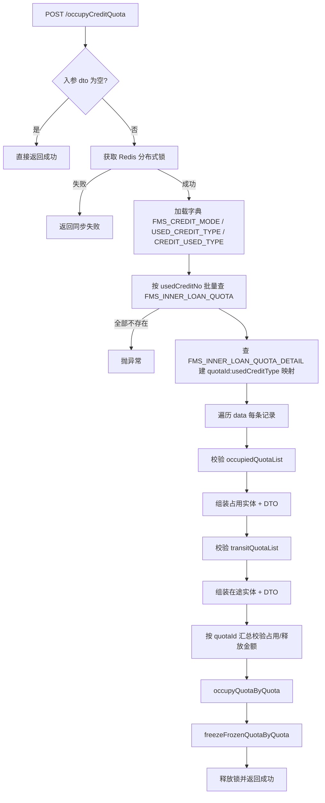

# insertCreditQuota 接口业务分析

> 接口：`cn.ztessc.service.api.ApiHandleService#insertCreditQuota`  
> HTTP 入口：`POST /occupyCreditQuota`  
> 接口编码：`FSSC-API-000293`  
> Controller：`cn.ztessc.controller.api.OutApiController#occupyCreditQuota`  
> 模块：zfs-fms-server-core

---

## 1. 接口概述

| 项目 | 说明 |
|------|------|
| **功能** | 用信额度占用/释放及在途冻结/释放写入 |
| **输入** | `CreditQuotaReqListDto`（含 `data` 列表，单次最多 1000 条） |
| **输出** | `StandardInterfaceSyncResponseDTO<SyncResponseItemDTO>` |
| **并发控制** | Redis 分布式锁，key = `credit:quota:usedCreditNo` |
| **核心 Service 方法** | `ApiHandleService#insertCreditQuota` |
| **额度更新** | `FmsInnerLoanQuotaService#occupyQuotaByQuota`（占用/释放） |
| **在途更新** | `FmsInnerLoanQuotaService#freezeFrozenQuotaByQuota`（冻结/释放在途） |

### 1.1 调用链

```
OutApiController#occupyCreditQuota
  └─ CreditQuotaReqListDto.getData()
       └─ ApiHandleService#insertCreditQuota(List<CreditQuotaReqDto>)
            ├─ occupyQuotaByQuota(occupyQuotaDtoList)      // 占用/释放
            └─ freezeFrozenQuotaByQuota(transitQuotaDtoList) // 在途
```

### 1.2 示例请求

```json
{
  "data": [{
    "usedCreditNo": "RZYX260700001",
    "occupiedQuotaList": [{
      "usedCreditType": "13",
      "creditMode": "01",
      "usedDate": "2026-07-01 11:43:34",
      "docNo": "HUASHI-KLMX26071",
      "creditAmount": 2271,
      "currencyCode": "CNY",
      "usedType": "2"
    }]
  }],
  "sourceSystem": "FSSC"
}
```

> **示例业务含义**：对用信编号 `RZYX260700001` **释放** 2271 元额度（`usedType=2` 为释放，非占用）。

---

## 2. 请求参数校验

### 2.1 外层 `CreditQuotaReqListDto`

| 字段 | 示例值 | 注解校验 | 业务校验 | 说明 |
|------|--------|----------|----------|------|
| `sourceSystem` | `"FSSC"` | **无**（仅有 `@ApiModelProperty`，无 `@NotBlank`） | **未使用** | 文档标注 required，代码中完全不读取 |
| `data` | `[{...}]` | **无**（无 `@NotEmpty` / `@Valid`） | 见 2.2 | 为 `null` 时 Controller 不报错；为空列表时 `insertCreditQuota` 直接返回成功 |

**Controller 层校验：**

- `dto == null` → 抛 `EXCEL_FLAG_DATA_ERROR`
- 单次最大条数：1000（`@OuterApiOperation onceSyncMaxNum = 1000`）

---

### 2.2 内层 `CreditQuotaReqDto`（`data[]` 每项）

| 字段 | 示例值 | 注解校验 | 业务校验 | 说明 |
|------|--------|----------|----------|------|
| `usedCreditNo` | `"RZYX260700001"` | `@NotBlank` + `@Length(max=32)` | ① 批量查 `FMS_INNER_LOAN_QUOTA`（`enabledFlag=有效`）<br>② 全部查不到 → 抛 `fms.used.credit.no.field.notfound`<br>③ 单条查不到 → **NPE** | 用信编号，关联主额度 |
| `occupiedQuotaList` | `[{...}]` | **无**（列表本身无校验） | 见 2.3；**为 null → NPE** | 占用/释放明细 |
| `transitQuotaList` | 示例未传 | **无** | 见 2.4；**为 null → NPE** | 在途冻结/释放明细；建议传 `[]` |

> `CreditQuotaReqDto` 的 `@NotBlank` 因外层 `data` 未加 `@Valid`，Controller 层**不会自动触发**；`usedCreditNo` 主要靠业务查询兜底。

---

### 2.3 `occupiedQuotaList[]` → `OccupyQuotaIDetailDto`

| 字段 | 示例 | Bean 校验（AddGroup） | 业务校验 | 入库映射 |
|------|------|----------------------|----------|----------|
| `usedType` | `"2"` | **必填** `@NotBlank`；`^[1-4]$` | 须在字典 `CREDIT_USED_TYPE` 中 | → `FMS_CREDIT_USAGE_RECORD.USED_TYPE` |
| `creditCode` | 未传 | `@Size(max=200)` | 无 | **被覆盖**：最终以 `usedCreditNo` 写入 `CREDIT_CODE` |
| `docNo` | `"HUASHI-KLMX26071"` | `@Size(max=64)` | 无 | **不落库**（实体无对应字段） |
| `creditMode` | `"01"` | 无必填 | 非空时须在字典 `FMS_CREDIT_MODE` 中 | → `CREDIT_MODE` |
| `usedCreditType` | `"13"` | 无必填 | **须在**字典 `USED_CREDIT_TYPE` 中（null 也会失败） | → `USED_CREDIT_TYPE`；并用于匹配子品种 `DETAIL_ID` |
| `creditLeId` | 未传 | `@Size(max=64)` | 无 | → `CREDIT_LE_ID` |
| `providerLeId` | 未传 | `@Size(max=64)` | 无 | → `PROVIDER_LE_ID` |
| `currencyCode` | `"CNY"` | 无必填 | 须在币种缓存中存在且有效（`GP00` 集团） | → `CURRENCY_CODE` |
| `creditAmount` | `2271` | `@DecimalMin(0)` + `@Digits(15,2)` | 汇总后：占用(1/3) ≤ 可用额度；释放(2/4) ≤ 已占用额度 | → `CREDIT_AMOUNT`（释放时存**负数**） |
| `usedDate` | `"2026-07-01 11:43:34"` | 格式 `yyyy-MM-dd HH:mm:ss` | 无 | → `USED_DATE` |
| `creditDays` | 未传 | `@Digits(10,2)` | 无 | → `CREDIT_DAYS` |

#### 占用类型枚举（`CREDIT_USED_TYPE`）

| 值 | 含义 | 金额处理 |
|----|------|----------|
| `1` | 占用 | 正数，增加占用、减少可用 |
| `2` | 释放 | 入参正数，内部转负数，减少占用、增加可用 |
| `3` | 结转占用 | 同占用 |
| `4` | 结转释放 | 同释放 |

---

### 2.4 `transitQuotaList[]` → `TransitQuotaDetailDto`（示例未传）

| 字段 | Bean 校验 | 业务校验 | 入库映射 |
|------|----------|----------|----------|
| `boeNo` | `@Size(max=64)` | 无 | → `FMS_QUOTA_TRANSIT_DETAIL.BOE_NO` |
| `boeName` | 无 | 无 | **不落库**（实体无字段） |
| `boeDate` | 格式 `yyyy-MM-dd` | 无 | → `BOE_DATE` |
| `usedType` | **必填** `@NotBlank`；`^[1-4]$` | 非空时须在 `CREDIT_USED_TYPE`；空则跳过字典校验（兼容历史，与 `@NotBlank` 存在矛盾） | 决定 `frozenQuota` 正负；未传时兜底取占用明细第一条的 `usedType` |
| `usedCreditType` | 无 | 须在 `USED_CREDIT_TYPE` 字典 | 用于匹配 `DETAIL_ID` |
| `currencyCode` | 无 | 币种缓存有效 | → `CURRENCY_CODE` |
| `frozenQuota` | `@DecimalMin(0)` + `@Digits(15,2)` | 无 | → 转 `BOE_AMOUNT`（释放时取负） |

---

### 2.5 全局 / 并发校验

| 校验项 | 说明 |
|--------|------|
| Redis 分布式锁 | key = `credit:quota:usedCreditNo`；获取失败返回 `fms.balance.sync.external.003`（正在同步，勿重复请求） |
| 批量额度汇总 | 按 `quotaId` 汇总本次占用/释放，与库中 `AVAILABLE_QUOTA` / `OCCUPY_QUOTA` 比较 |
| Bean 校验失败 | 返回 `code=-1`，`msg` 为第一条错误信息 |
| 占用超限 | 抛 `fms.credit.quota.occupy.exceed.available` |
| 释放超限 | 抛 `fms.credit.quota.release.exceed.occupy` |
| 币种无效 | 抛 `fms.currency.error` |
| 字典值无效 | 抛 `fms.params.field.notfound`（用信方式 / 用信类型 / 占用类型 / 在途占用类型） |

---

## 3. 涉及的数据表

| 表名 | 操作 | 角色 |
|------|------|------|
| `FMS_INNER_LOAN_QUOTA` | **读 + 更新** | 用信额度主表 |
| `FMS_INNER_LOAN_QUOTA_DETAIL` | **读 + 更新** | 用信子品种明细 |
| `FMS_INNER_LOAN_QUOTA_BREED` | **更新** | 用信分类汇总 |
| `FMS_CREDIT_USAGE_RECORD` | **插入** | 占用/释放流水 |
| `FMS_QUOTA_TRANSIT_DETAIL` | **插入** | 在途冻结/释放流水（仅有 `transitQuotaList` 时） |

---

## 4. 业务逻辑流程



---

## 5. 各表字段处理逻辑

### 5.1 `FMS_INNER_LOAN_QUOTA`（主额度）

#### 读取（前置）

- 条件：`USED_CREDIT_NO = ?` AND `ENABLED_FLAG = 有效`
- 用途：获取 `ID`、`AVAILABLE_QUOTA`、`OCCUPY_QUOTA` 等

#### 更新（占用路径：`occupyQuotaByQuota` → `availableConversionToOccupancy`）

| 字段 | 占用 / 结转占用 (1/3) | 释放 / 结转释放 (2/4) |
|------|----------------------|----------------------|
| `OCCUPY_QUOTA` | `OCCUPY_QUOTA + 金额` | `OCCUPY_QUOTA + 负数`（即减少） |
| `AVAILABLE_QUOTA` | `AVAILABLE_QUOTA - 金额` | `AVAILABLE_QUOTA - 负数`（即增加） |
| `LAST_UPDATE_DATE` / `LAST_UPDATE_BY` | 当前用户 / 时间 | 同左 |

SQL 示例：

```sql
UPDATE FMS_INNER_LOAN_QUOTA
SET OCCUPY_QUOTA = OCCUPY_QUOTA + ?,
    AVAILABLE_QUOTA = AVAILABLE_QUOTA - ?,
    LAST_UPDATE_DATE = ?,
    LAST_UPDATE_BY = ?
WHERE ID = ?
```

#### 更新（在途路径：`freezeFrozenQuotaByQuota`）

| 字段 | 冻结 (1/3) | 释放在途 (2/4) |
|------|-----------|----------------|
| `FROZEN_QUOTA` | `FROZEN_QUOTA + 金额` | `FROZEN_QUOTA + 负数` |
| `AVAILABLE_QUOTA` | `AVAILABLE_QUOTA - 金额` | `AVAILABLE_QUOTA - 负数` |

SQL 示例：

```sql
UPDATE FMS_INNER_LOAN_QUOTA
SET FROZEN_QUOTA = FROZEN_QUOTA + ?,
    AVAILABLE_QUOTA = AVAILABLE_QUOTA - ?,
    LAST_UPDATE_DATE = ?,
    LAST_UPDATE_BY = ?
WHERE ID = ?
```

---

### 5.2 `FMS_INNER_LOAN_QUOTA_DETAIL`（子品种）

#### 读取

- `findByQuotaIds`：建立 `quotaId:usedCreditType → detailId` 映射
- `fillDtoDetailId`：按 `usedCreditType` 补全 `DETAIL_ID`

#### 更新（占用路径）

| 字段 | SQL 逻辑 |
|------|----------|
| `USED_QUOTA` | `USED_QUOTA + ?` |
| `AVAILABLE_QUOTA` | `AVAILABLE_QUOTA - ?` |

#### 更新（在途路径）

| 字段 | SQL 逻辑 |
|------|----------|
| `FROZEN_QUOTA` | `FROZEN_QUOTA + ?` |
| `AVAILABLE_QUOTA` | `AVAILABLE_QUOTA - ?` |

> **注意**：若 `usedCreditType` 匹配不到子品种，`DETAIL_ID` 为空，`occupyQuotaByQuota` 可能提前 return，导致额度不更新、流水不写。

---

### 5.3 `FMS_INNER_LOAN_QUOTA_BREED`（分类汇总）

由子品种 `BREED_ID` 向上汇总，字段更新逻辑与 DETAIL 层一致：

- **占用路径**：`USED_QUOTA +/-`、`AVAILABLE_QUOTA -/+`
- **在途路径**：`FROZEN_QUOTA +/-`、`AVAILABLE_QUOTA -/+`

---

### 5.4 `FMS_CREDIT_USAGE_RECORD`（占用流水）

| 字段 | 来源 / 逻辑 |
|------|------------|
| `ID` | `UuidUtils.getUuid()` |
| `QUOTA_ID` | 由 `usedCreditNo` 查得主表 ID |
| `CREDIT_CODE` | **强制** = 外层 `usedCreditNo`（忽略明细中的 `creditCode`） |
| `CREDIT_MODE` | 入参 `creditMode` |
| `USED_CREDIT_TYPE` | 入参；后续可能从 DETAIL 补全 |
| `CREDIT_LE_ID` / `PROVIDER_LE_ID` | 入参 |
| `CURRENCY_CODE` | 入参 |
| `CREDIT_AMOUNT` | 入参值；**释放(2/4) 存负数** |
| `USED_TYPE` | 入参 `usedType` |
| `USED_DATE` | 入参 `usedDate` 解析 |
| `CREDIT_DAYS` | 入参 |
| `DETAIL_ID` | 由 `usedCreditType` 匹配子品种 |
| `CREATE_BY` / `CREATE_DATE` 等 | `EntityUtils.setWho()` |

**示例（`usedType=2` 释放 2271）写入效果：**

| 字段 | 值 |
|------|-----|
| `CREDIT_CODE` | `RZYX260700001` |
| `CREDIT_AMOUNT` | `-2271` |
| `USED_TYPE` | `2` |
| 主表效果 | `OCCUPY_QUOTA -= 2271`，`AVAILABLE_QUOTA += 2271` |

> `docNo`（如 `HUASHI-KLMX26071`）**不会写入任何字段**。

---

### 5.5 `FMS_QUOTA_TRANSIT_DETAIL`（在途流水）

| 字段 | 来源 |
|------|------|
| `ID` | UUID |
| `QUOTA_ID` | 主表 ID |
| `DETAIL_ID` | `quotaId + usedCreditType` 匹配 |
| `BOE_NO` | `boeNo` |
| `BOE_DATE` | `boeDate` |
| `CURRENCY_CODE` | 入参 |
| `BOE_AMOUNT` | `frozenQuota`（释放时取负） |
| 审计字段 | `EntityUtils.setWho()` |

---

## 6. 示例参数分析

针对以下请求：

```json
{
  "data": [{
    "usedCreditNo": "RZYX260700001",
    "occupiedQuotaList": [{
      "usedCreditType": "13",
      "creditMode": "01",
      "usedDate": "2026-07-01 11:43:34",
      "docNo": "HUASHI-KLMX26071",
      "creditAmount": 2271,
      "currencyCode": "CNY",
      "usedType": "2"
    }]
  }],
  "sourceSystem": "FSSC"
}
```

| 检查点 | 结果 |
|--------|------|
| 业务含义 | **释放**用信额度 2271（非占用） |
| `sourceSystem` | 被忽略，不参与业务 |
| `docNo` | 仅做长度校验，不落库 |
| `transitQuotaList` 未传 | **存在 NPE 风险**，建议传 `"transitQuotaList": []` |
| 前置条件 | `RZYX260700001` 在 `FMS_INNER_LOAN_QUOTA` 存在且有效；`usedCreditType=13` 有对应 DETAIL；当前 `OCCUPY_QUOTA ≥ 2271` |
| 字典校验 | `01` ∈ `FMS_CREDIT_MODE`，`13` ∈ `USED_CREDIT_TYPE`，`2` ∈ `CREDIT_USED_TYPE`，`CNY` 币种有效 |

---

## 7. 注意事项

1. **`occupiedQuotaList` / `transitQuotaList` 不要传 null**，至少传空数组 `[]`。
2. **`data` 内层字段的 JSR-303 注解未在 Controller 生效**（缺 `@Valid`），主要依赖方法内手动校验。
3. **占用与在途是两条独立链路**：占用走 `occupyQuotaByQuota`，在途走 `freezeFrozenQuotaByQuota`；在途的 `usedType` 可独立于占用明细。
4. **释放金额以正数传入**，系统内部转负后更新额度；流水表 `CREDIT_AMOUNT` 存负数。
5. 若需关联业务单据，当前接口**不支持**通过 `docNo` 持久化，需扩展实体或映射到其他字段（如 `CREDIT_ID` / `SUB_CREDIT_ID`）。
6. 接口成功时返回 `resDto.ok(String.valueOf(dto.size()), "success")`，即按 `data` 条数计成功数。

---

## 8. 关键代码位置

| 类 / 方法 | 路径 |
|-----------|------|
| Controller | `zfs-fms-server-core/.../OutApiController.java#occupyCreditQuota` |
| 核心业务 | `zfs-fms-server-core/.../ApiHandleService.java#insertCreditQuota` |
| 占用/释放 | `zfs-fms-settlement-core/.../FmsInnerLoanQuotaService.java#occupyQuotaByQuota` |
| 在途冻结 | `zfs-fms-settlement-core/.../FmsInnerLoanQuotaService.java#freezeFrozenQuotaByQuota` |
| 请求 DTO | `zfs-fms-common-core/.../CreditQuotaReqListDto.java` |
| 请求 DTO | `zfs-fms-common-core/.../CreditQuotaReqDto.java` |
| 占用明细 DTO | `zfs-fms-common-core/.../OccupyQuotaIDetailDto.java` |
| 在途明细 DTO | `zfs-fms-common-core/.../TransitQuotaDetailDto.java` |
